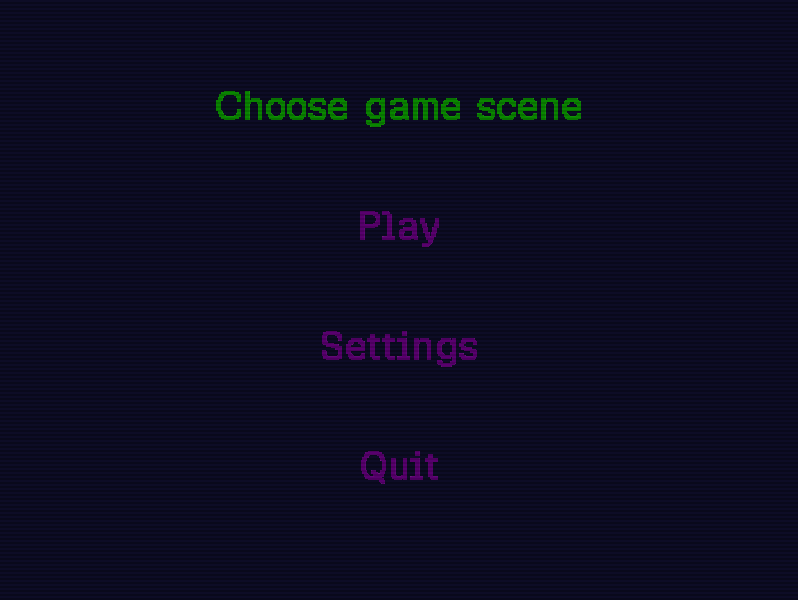

# BreakGL

Work in progress. A Breakout clone built from scratch in C++ with OpenGL 3.3 Core Profile.

## Architecture

The core is a custom Entity-Component-System based on this implementation (https://austinmorlan.com/posts/entity_component_system/).

Rendering is done with raw OpenGL. Shaders are loaded and compiled at runtime.

## Dependencies

OpenGL 3.3, GLFW, GLAD, GLM, FreeType

